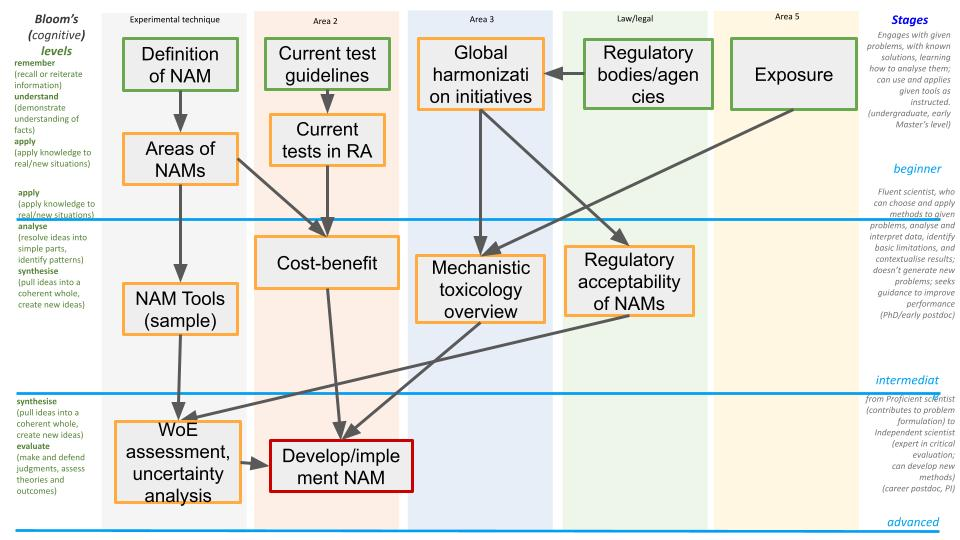

# Introduction

The fourth workshop of the [INTOXICOM Implementation Study](https://index.biohackrxiv.org/tag/INTOXICOM),
titled “Registration of Project Courses in ELIXIR
TeSS and Conversion of Open Educational Resources into Toxicology Curricula”, was held on 24–25 June 2025
at the University of Birmingham, UK. An introductory webinar on 6 June 2025 prepared participants by
introducing workshop objectives and gathering initial educational resources.

This workshop is part of INTOXICOM’s effort to make toxicology educational resources FAIR (Findable,
Accessible, Interoperable, and Reusable) [@citesAsRecommendedReading:FAIR] and to establish a sustainable training ecosystem
within the ELIXIR infrastructure. The meeting brought together toxicology and bioinformatics trainers,
educators, curriculum developers, and FAIR training experts to collaboratively design structured curricula
in the form of ELIXIR Learning Paths.

# Workshop Objectives and Approach

The workshop aimed to:

* Increase discoverability of toxicology training materials by registering them in ELIXIR Training e-Support Service (TeSS, [https://tess.elixir-europe.org/](https://tess.elixir-europe.org/)) [@discusses:Rioualen2024Synergising]
* Introduce FAIR training principles, metadata annotation, and Bioschemas [@discusses:Gray2017Bioschemas] for automated population of resources
* Build shared expertise on developing learning paths, a structured curriculum concept within ELIXIR
* Co-design toxicology-specific learning paths that address gaps in current training and support modern approaches to chemical and nanomaterial safety assessment

Hands-on sessions provided participants with practical experience design, develop, 
populate learning paths, and about governance and sustainability within TeSS.

# Presentations

Invited speakers and organisers gave a series of talks framing the workshop, covering the
ELIXIR training services and the Learning Paths framework, the regulatory and legal context
that toxicology training has to serve, and existing collections of training material.
Robert Lee and Susana Loureiro joined online.

Table: Presentations delivered at the workshop.

| Speaker | Talk Title |
| --- | -------- |
| Egon Willighagen | Introduction to ELIXIR and the ELIXIR Toxicology Community |
| Alexia Cardona | Introduction to ELIXIR Training Services |
| Alexia Cardona | Introduction to the ELIXIR Learning Paths Framework |
| Robert Lee | Legal oversight and regulatory toxicology |
| Susana Loureiro | Example of the PARC registry: mapping existing training materials |
| Martin Himly | From material compilations of content providers to toxicology curricula: requirements for building knowledge |
| Sara Morsy | The FAIR training life cycle |

# Understanding Learning Paths

Participants gained a shared understanding of ELIXIR Learning Paths, which guide learners through a sequence of training materials from foundational to advanced levels ([https://tess.elixir-europe.org/about/learning_paths](https://tess.elixir-europe.org/about/learning_paths)). Through guided exercises, attendees explored how to structure toxicology curricula, link resources, and annotate them with standardized metadata.

Discussions highlighted key requirements for FAIR toxicology training, including improved ontology coverage, mechanisms for maintaining up-to-date curricula, and strategies for automated population of TeSS resources using Bioschemas ([https://bioschemas.org/](https://bioschemas.org/)).

# Proposed Toxicology Learning Paths

Four thematic learning paths were conceptualized during breakout sessions:

* New Approach Methodologies (NAMs) – A curriculum encompassing modern, animal-free methods integrating in vitro, omics, molecular AOPs, and computational tools for regulatory toxicology
* FAIR AOP Development – Training for constructing and curating Adverse Outcome Pathways with semantic web technologies and FAIR principles
* FAIR Nanotoxicology Data – Modules for harmonizing nanosafety datasets with standardized metadata and interoperability practices
* In Silico Hazard Prediction – Computational training covering QSARs, molecular docking, and network-based modeling for chemical and nanomaterial hazard assessment

# Target Audience for Toxicology Learning Paths

The learning paths developed during Workshop 4 are designed to address the training needs of early-career researchers entering the field of modern toxicology. The primary audience consists of individuals with a Bachelor’s degree in biology, chemistry, pharmacy, biochemistry, molecular biosciences, medical biology, or veterinary medicine, and ideally a Master’s degree in one of these disciplines or in toxicology.

These curricula particularly support early-stage researchers, such as PhD students, who require structured training to rapidly build expertise in emerging toxicology approaches. The paths are also suitable for postgraduates and professionals transitioning into computational toxicology, nanotoxicology, or regulatory science who need to understand mechanistic safety assessment and FAIR data practices.

All four learning paths—New Approach Methodologies (NAMs), FAIR AOP Development, FAIR Nanotoxicology Data, and In Silico Hazard Prediction—share this baseline audience. Individual paths can be tailored to specific interests and backgrounds, for example by focusing more heavily on laboratory methods, data science, or regulatory applications.

# NAMs Learning Path: First Prototype

The workshop developed a detailed draft of the NAMs learning path as a pilot for structured toxicology curricula within ELIXIR TeSS. This prototype outlines a modular program introducing XXXX <!-- TODO [add module/block groups] -->
for using and integrating NAM data in risk assessment frameworks.

The learning path is designed for participants with a Bachelor’s degree in biology, chemistry, pharmacy, biochemistry, molecular biosciences, medical biology, or veterinary medicine, and ideally a Master’s degree in one of these disciplines or in toxicology. It particularly targets early-stage researchers (e.g., beginning a PhD project) who need to quickly acquire a mechanistic understanding of modern, animal-free safety assessment approaches.

The NAMs path builds on existing courses and modules, such as those in the University of [Birmingham’s MSc Toxicology](https://www.birmingham.ac.uk/study/postgraduate/subjects/biosciences-courses/toxicology-msc) program and training developed within VHP4Safety, ensuring alignment with established academic and project-based offerings. 



# Ontology Development for FAIR Training Metadata

Another outcome of the workshop was the identification of gaps in toxicology-specific ontology terms used for annotating training resources in TeSS. Without these terms, toxicology courses and materials cannot be consistently described or discovered across the ELIXIR ecosystem.

Participants compiled a list of proposed additions or refinements to the EDAM ontology [@citesAsPotentialSolution:Ison2013EDAM], including high-level terms such as Toxicology, and specialized subfields including Medical Toxicology, Ecotoxicology, Forensic Toxicology, and Environmental Toxicology. For each term, draft definitions were prepared, relationships to existing ontology terms were mapped, and links to related ontologies (e.g., OMIT, NCIT) were identified.

This work will be submitted to the EDAM ontology maintainers for inclusion in future releases. Expanding EDAM with toxicology-specific terms will allow:

* Precise tagging of training materials in TeSS, improving discoverability
* Automated assembly of learning paths, since resources can be filtered and grouped by ontology tags (e.g., all resources related to NAMs or regulatory toxicology)
* Better integration with FAIR data and tool registries (e.g., bio.tools, FAIRsharing), enabling cross-linking of courses, datasets, and software relevant to toxicology

The compiled list of terms, definitions, and ontology links is included as
an Appendix A to this report.

# Towards Automated Population of Resources

A key recommendation from the workshop is the automation of resource population into TeSS. The group discussed implementing Bioschemas markup on external training repositories (e.g., [PARC Learning Materials](https://www.eu-parc.eu/learning-materials)) to allow automated harvesting by TeSS. This approach would ensure sustainable growth of registered resources and reduce manual effort for course providers.

Ontology improvements were also identified as necessary for toxicology-specific training annotation. The proposals to extend the EDAM ontology ([https://edamontology.org/](https://edamontology.org/)) will enrich keyword coverage and enable accurate classification of toxicology educational resources.

# Path Initiation and Community Uptake

Besides the NAMs path, the workshop initiated schematic outlines for three additional learning paths: “FAIR AOP development”, “FAIR nanotoxicology data”, and “In silico (chemical and nanomaterial) hazard prediction”. These will be further refined and are intended to be picked up by educators within the ELIXIR Toxicology Community. The workshop established the
Toxicology Community as a future content provider in TeSS
to initiate a coordinated curation process and community-driven maintenance of these learning paths. Our community now is both [a provider](https://tess.elixir-europe.org/content_providers/elixir-toxicology-community)
and has [a collection](https://tess.elixir-europe.org/collections/elixir-toxicology-community).

# Conclusions and Future Directions

Workshop 4 successfully built a shared understanding of FAIR training principles and delivered an initial learning path prototype and a set of draft learning paths for the ELIXIR Toxicology Community to adopt. The NAMs learning path prototype is a concrete output of the workshop and serves as an example for further development of toxicology education pathways.

Next steps include finalizing the NAMs path with broader stakeholder review, expanding and linearizing the other three proposed paths, contributing new ontology terms, and initiating automated resource harvesting via Bioschemas. 

## Funding

This workshop was funded by the ELIXIR Europe INTOXICOM grant (Grant No. NL-2023-INTOXICOM).

## References

```{=latex}
\AtEndDocument{%
```

\blandscape

# Appendix A

Table: Analysis of EDAM for terms for toxicology.

| Level 1 | Level 2 | Level 3 | Existing or proposed Definition | Related term name | (EDAM) ID |
| ------- | ------- | ------- | ------------------------------- | ----------------- | --------- |
| Toxicology |         |         | Toxins and the adverse effects of these chemical substances on living organisms |                   | [EDAM:2840](http://edamontology.org/topic_2840) |
|         | Medical toxicology [^1]  |         | The branch of medicine that deals with the diagnosis, management and prevention of poisoning and other adverse health effects caused by medications, occupational and environmental toxins, and biological agents. |                   | [EDAM:3415](http://edamontology.org/topic_3415) |
|         | Ecotoxicology |         |                                 |                   | [OMIT_0025989](http://purl.obolibrary.org/obo/OMIT_0025989) [^2] |
|         | Forensic toxicology |         |                                 |                   | [OMIT_0025472](http://purl.obolibrary.org/obo/OMIT_0025472) |
|         | Environmental toxicology |         |                                 |                   | [NCIT_C17603](http://purl.obolibrary.org/obo/NCIT_C17603) [^3] |
|         | Regulatory toxicology |         |                                 |                   |           |
|         |         | CMR |                                 |                   |           |
|         |         | EDC |                                 |                   |           |
|         |         | Genotox |                                 |                   |           |
|         |         | Developmental tox |                                 |                   |           |
|         |         | Neurotox |                                 |                   |           |
|         | Occupational Health |         |                                 |                   | [NCIT_C17381](http://purl.obolibrary.org/obo/NCIT_C17381) |
|         | Cellular Toxicology |         |                                 |                   |           |         |
|         | Molecular Toxicology  |         |                                 |                   | [NCIT_C19571](http://purl.obolibrary.org/obo/NCIT_C19571) |
|         | Mechanistic Toxicology |         |                                 |                   |           |
|         | Computational Toxicology [^4] |         |                                 |                   |           |
|         |         | Chemo- informatics | The application of information technology to chemistry in biological research environment. [^5] |           | [EDAM:2258](http://edamontology.org/topic_2258) |
|         |         | Nanoinformatics |                                 |                   |           |
|         |         | QSARs |                                 |                   | [OMIT_0020804](http://purl.obolibrary.org/obo/OMIT_0020804) |
|         |         | PBPK modelling |                                 |                   |           |
|         |         | Exposure modelling |                                 |                   |           |
|         |         | dose-response modelling |                                 |                   |           |
|         |         | QVIVE modelling |                                 |                   |           |
| Stressor [^6] |         |         |                                 |                   |           |
|         | EDC |         |                                 |                   |           |
|         | Nanomaterials |         |                                 |                   |           |
|         | Micro & Nanoplastics |         |                                 |                   |           |
|         | Pesticides |         |                                 |                   |           |
|         | Pharmaceuticals |         |                                 |                   |           |
|         | MESH ontology of stressors |         |                                 |                   |           |
| Testing approach |         |         |                                 |                   |           |
|         | In Vivo |         | An assay in which the effect of a targeted process (the intervention) on an organism is tested. | in vivo intervention experiment | [OBI_0001980](http://purl.obolibrary.org/obo/OBI_0001980) |
|         |         | organ toxicity |                                 |                   |           |
|         |         | system toxicity |                                 |                   |           |
|         |         | organism effect |                                 |                   |           |
|         |         | population effect |                                 |                   |           |
|         |         | ecosystem effect |                                 |                   |           |
|         | In vitro |         |                                 |                   |           |
|         |         | Molecular event |                                 |                   |           |
|         |         | Cellular response |                                 |                   |           |
|         | In silico |         |                                 |                   |           |
| Domain of  Interest |         |         |                                 |                   |           |
|         | Policy and regulation |         | The protection of public health by controlling the safety and efficacy of products in areas including pharmaceuticals, veterinary medicine, medical devices, pesticides, agrochemicals, cosmetics, and complementary medicines. | Regulatory affairs | [EDAM:3394](http://edamontology.org/topic_3394) |
|         | Exposure assessment |         |                                 |                   |           |
|         | Hazard and risk |         |                                 |                   |           |
|         | FAIR data and data management |         | FAIR data is scientific data that meets the principles of being findable, accessible, interoperable, and reusable. A substantially overlapping term is 'open data', i.e. publicly available data that is free to use, distribute, and create derivative work from, without restrictions. Open data does not automatically have to be FAIR (e.g. findable or interoperable), while FAIR data does in some cases not have to be publicly available without restrictions (especially sensitive, protected data, topic_4044). | FAIR data | [EDAM:4012](http://edamontology.org/topic_4012) |
|         |         |         | Data management comprises the practices and principles of taking care of data, other than analysing them. This includes for example taking care of the associated metadata, data formats, storage, preservation/archiving, access, and legal aspects related to using and sharing data. The purpose of data management is keeping data consistent, easy to access and use, while ensuring a required level of data protection. Good data management improves the visibility, impact, and lifetime of data. | Data Management | [EDAM:3071](http://edamontology.org/topic_3071) |
|         | Safe and Sustainable by Design |         |                                 |                   |           |
|         | Statistics |         |                                 | Statistics & Probability | [EDAM:2269](http://edamontology.org/topic_2269) |
|         | NAM |         |                                 |                   |           |
| Scope |         |         |                                 |                   |           |
|         | Advanced (nano)materials |         |                                 |                   |           |
|         | Biotechnology |         |                                 |                   | EDAM:3297 |
|         | Chemicals |         |                                 |                   |           |
|         | Chemical mixtures |         |                                 |                   |           |
|         | Pesticides |         |                                 |                   |           |
| Target stakeholder |         |         |                                 |                   |           |
|         | Academia (PhD and MSc student, professor, researcher) |         |                                 |                   |           |
|         | Consultants |         |                                 |                   |           |
|         | Education (schools and undergraduates) |         |                                 |                   |           |
|         | Industry |         |                                 |                   |           |
|         | NGOs |         |                                 |                   |           |
|         | Regulator, policy maker, risk assessor |         |                                 |                   |           |
| Type of material |         | Format of documents including word processor, spreadsheet and presentation. |                                 |                   |           |
|         | Course |         | A training course available for use on the Web. |                   |           |
|         | E-learning tool |         |                                 | Document format | [EDAM:3507](http://edamontology.org/format_3507) |
|         | Presentation / slides |         |                                 | Online course | [EDAM:3670](http://edamontology.org/data_3670) |
|         | Reading materials |         |                                 |                   |           |
|         | Video |         |                                 |                   |           |
|         | Webinar recording |         |                                 |                   |           |
| Level of expertise |         |         |                                 |                   |           |
|         | Beginner |         |                                 |                   |           |
|         | Intermediate |         |                                 |                   |           |
|         | Advanced |         |                                 |                   |           |

[^1]: Note: Synonym to existing EDAM term Clinical toxicology
[^2]: OMIT is microRNA; doesnt provide definition for terms
[^3]: National Cancer Institute Thesaurus
[^4]: Synonym: In Silico Toxicology
[^5]: Wrong definion. It's not limited to biological research environments.
[^6]: What about alternative grouping terms such as contaminants of emerging concern (CECs), persistent organic pollutants (POPs), etc?

\elandscape

```{=latex}
}
```
